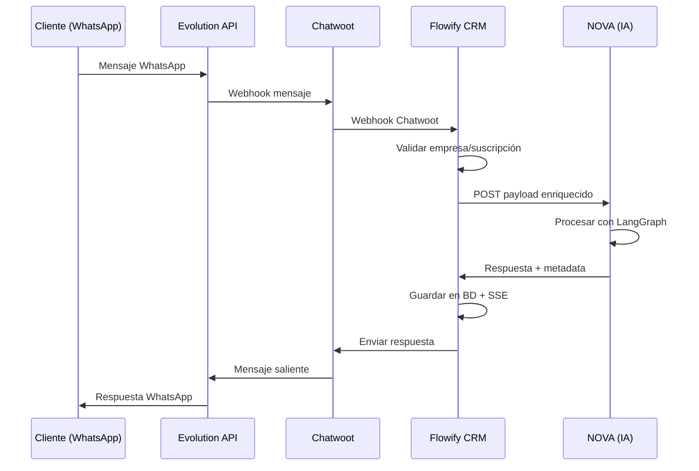

# 🏗️ Arquitectura Actual de Flowify CRM

**Última actualización:** Diciembre 22, 2024  
**Estado:** 98% Completo - Listo para Producción

## 📋 Visión General

Flowify es un CRM multi-tenant enterprise-grade que orquesta conversaciones automatizadas con IA a través de múltiples canales. La arquitectura está diseñada para escalabilidad, seguridad y aislamiento completo entre tenants.

### Características Principales
- ✅ **Multi-tenant nativo** con aislamiento completo
- ✅ **IA generativa** con agentes autónomos (NOVA, PULSE, NEXUS)
- ✅ **Tiempo real** con Server-Sent Events (SSE)
- ✅ **Pipeline de ventas** completo con forecast
- ✅ **Integraciones** Chatwoot + Evolution API + NOVA
- ✅ **Sistema de suscripciones** con entitlements granulares

## 🔄 Flujo de Datos Principal



## 🏢 Arquitectura Multi-tenant

### Aislamiento por Empresa
- Cada empresa es un **tenant completamente aislado**
- `empresa_id` en todos los modelos de datos
- API keys únicas por empresa
- Configuraciones independientes

### Modelo de Datos
```
Empresa (Tenant)
├── Usuarios (empleados/agentes humanos)
├── Agentes IA (NOVA, PULSE, NEXUS)
├── Contactos (clientes finales)
├── Conversaciones
│   ├── Mensajes
│   ├── Favoritos (es_favorito)
│   └── Papelera (en_papelera)
├── Deals (pipeline ventas)
│   ├── Productos
│   ├── DealProducto (relación)
│   └── Pipelines personalizados
├── Teams
│   └── TeamMembers
├── Suscripciones
│   ├── Planes (FREE, DEMO_PRO, PRO, ENTERPRISE)
│   └── Entitlements
└── Configuración
    ├── Chatwoot (account_id, api_key, webhook_id)
    └── Evolution (instance_id, WhatsApp)
```

## 🧠 Sistema de IA (NOVA)

### Arquitectura NOVA
- **Microservicio independiente** Python/LangGraph
- **Migración completa**: Sin dependencias de n8n
- **Multi-tenant**: System prompts por empresa/nicho
- **RAG**: Base de conocimiento por empresa
- **Webhooks seguros**: Validación HMAC habilitada

### Contrato Flowify ↔ NOVA

**Flowify → NOVA:**
```json
{
  "empresa_id": 1,
  "empresa_slug": "pizzeria-roma",
  "agente_config": {
    "system_prompt": "Eres asistente de pizzería...",
    "temperature": 0.7
  },
  "mensaje": {
    "texto": "Tienen pizzas?",
    "contacto": "Marlon Pernia",
    "telefono": "+584122236071"
  },
  "conversacion_id": 2
}
```

**NOVA → Flowify:**
```json
{
  "empresa_id": 1,
  "conversacion_id": 2,
  "respuesta_agente": {
    "texto": "¡Sí! Tenemos pizzas. ¿Quieres ver el menú?"
  },
  "requires_human": false,
  "actions": {
    "set_ia_state": null,
    "apply_labels": ["consulta_menu"]
  },
  "nlu": {
    "intent": "menu_consulta",
    "confidence": 0.86
  }
}
```

## 🔗 Integraciones

### Chatwoot (Hub de Conversaciones)
- **Platform API**: Gestión de cuentas y usuarios
- **Account API**: Conversaciones y mensajes
- **Webhooks**: Eventos en tiempo real
- **Custom Attributes**: `ia_state`, prioridades
- **Labels**: Control visual de estados

### Evolution API (WhatsApp Gateway)
- Conexión con WhatsApp Business
- QR Code para vinculación
- Webhooks bidireccionales
- Soporte multimedia

### Base de Datos (PostgreSQL)
- **Supabase** como proveedor
- **SQLAlchemy Async** como ORM
- **Alembic** para migraciones
- Índices optimizados para multi-tenancy

## 🎛️ Control de IA

### Estados de IA
- **ON**: IA responde automáticamente
- **OFF**: Solo humanos responden

### Gating Inteligente
```python
# Condiciones para activar IA
if (empresa.activa and 
    suscripcion.nova_enabled and 
    agente_nova.activo and 
    ia_state == "on" and 
    not takeover_humano):
    # Enviar a NOVA
```

### Handoff IA → Humano
- Detección automática de escalación
- Cambio de `ia_state` a "off"
- Asignación a agente humano
- Etiquetas visuales en Chatwoot

## 💰 Sistema de Suscripciones

### Planes Disponibles
- **FREE**: Sin IA, solo gestión manual, human_intervention='always_on'
- **DEMO_PRO**: IA completa por 7 días, sin límite de mensajes, una sola demo por empresa
- **PRO**: IA completa sin límites (NOVA habilitado)
- **ENTERPRISE**: IA + features avanzadas + SLA

### Entitlements (Source of Truth)
```json
{
  "nova_enabled": true,
  "pulse_enabled": false,
  "nexus_enabled": false,
  "max_conversations": 1000,
  "advanced_analytics": true,
  "demo_active": true,
  "demo_ends_at": "2025-12-29T00:00:00Z"
}
```

### Control de Acceso
- Validación en cada webhook antes de enviar a NOVA
- Gating unificado: `empresa.configuracion.subscription.entitlements.nova_enabled`
- Degradación automática al expirar demo
- Notificaciones SSE al frontend
- Corte inmediato al expirar `demo_ends_at`

## 📡 Tiempo Real (SSE)

### Server-Sent Events
- **Eventos**: mensajes, asignaciones, cambios IA
- **Por tenant**: aislamiento completo
- **Heartbeat**: cada 25 segundos
- **Auto-reconexión**: en el frontend

### Tipos de Eventos
```typescript
type SSEEvent = 
  | "message"              // Nuevo mensaje
  | "conversation_created" // Nueva conversación
  | "conversation"         // Cambio conversación
  | "assignment"           // Asignación usuario/team
  | "ia_state"            // Cambio estado IA
  | "status"              // Cambio de estado (nuevo/abierto/cerrado)
  | "typing"              // Indicador de escritura
  | "read_receipt"        // Confirmación de lectura
  | "demo_status"         // Estado demo
  | "heartbeat"           // Keep-alive (cada 25s)
```

## 🔒 Seguridad

### Autenticación
- **JWT** con expiración 24h
- **bcrypt** para passwords
- **HMAC** para webhooks (configurable)

### Multi-tenancy
- Filtros automáticos por `empresa_id`
- Validación en cada endpoint
- API keys únicas por tenant

### Validación de Datos
- **Pydantic** schemas
- **SQLAlchemy** constraints
- **TypeScript** en frontend

## 📊 Pipeline de Ventas

### Modelo de Deals
- **Etapas**: lead → calificado → propuesta → negociacion → ganado/perdido
- **Vinculación**: conversacion_id (persistencia dual)
- **Productos**: Catálogo por empresa + DealProducto con cantidades/precios
- **Pipelines personalizados**: Cada empresa define sus etapas
- **Monedas**: USD, EUR, VES, COP, MXN
- **Origen**: conversacion, manual, ia_automatico, importacion, web_form

### Métricas Avanzadas
- **Revenue**: total, ganado, ponderado (monto × probabilidad)
- **Tasa de conversión**: deals ganados / total deals
- **Time-to-win**: Tiempo medio desde creación hasta cierre (días)
- **Forecast**: Proyección por meses con fecha_cierre_estimada
- **Estadísticas**: Por etapa, usuario, equipo, pipeline
- **Ticket promedio**: Revenue total / cantidad deals

### Políticas IA para Deals
- `auto_create_deals=false` por defecto
- `deal_confidence_threshold=0.75` para sugerencias IA
- Override manual desde UI
- Anti-duplicados: 1 deal por conversacion_id en ventana de 72h

## 🎨 Frontend (Next.js)

### Stack Tecnológico
- **Next.js 16** con App Router
- **TypeScript** completo
- **Tailwind CSS v4**
- **shadcn/ui** componentes
- **SWR** para data fetching

### Páginas Principales
- Dashboard con métricas
- Inbox de conversaciones (SSE)
- Gestión de contactos
- Pipeline de deals
- Configuración de agentes
- Reportes y analytics

## 🔧 Configuración por Entorno

### Desarrollo
```env
DATABASE_URL=postgresql://localhost/flowify_dev
CHATWOOT_URL=http://localhost:3000
NOVA_WEBHOOK_URL=http://localhost:8001
```

### Producción
```env
DATABASE_URL=postgresql://supabase-url
CHATWOOT_URL=https://chat.empresa.com
NOVA_WEBHOOK_URL=https://nova.empresa.com
CHATWOOT_WEBHOOK_SECRET=production-secret
```

## 📈 Escalabilidad

### Horizontal
- Múltiples instancias FastAPI
- Load balancer con sticky sessions (SSE)
- NOVA como microservicio independiente

### Vertical
- Índices optimizados en BD
- Caché con Redis (futuro)
- CDN para assets estáticos

### Observabilidad
- Logs estructurados
- Métricas de performance
- Health checks
- Error tracking

## 🚀 Próximos Pasos

### Corto Plazo (1 semana)
1. ✅ Activar notificación RAG a NOVA (`conocimiento.py:91`)
2. ✅ Habilitar validación HMAC producción (`webhooks_chatwoot.py:23-25`)
3. ⏳ Tests automatizados básicos

### Mediano Plazo (2-4 semanas)
1. ⏳ Caché Redis para estadísticas
2. ⏳ Observabilidad avanzada (Sentry, LogRocket)
3. ⏳ Mobile app (React Native)
4. ⏳ Integraciones adicionales (Stripe, Zapier)

### Largo Plazo (3-6 meses)
1. 🔜 PULSE y NEXUS agentes operativos
2. 🔜 AI Analytics avanzados
3. 🔜 Marketplace de integraciones
4. 🔜 White-label para revendedores

---

## 📚 Documentación Relacionada

- **Estado del Proyecto:** [`ESTADO_PROYECTO.md`](ESTADO_PROYECTO.md)
- **Instalación:** [`setup/INSTALACION.md`](setup/INSTALACION.md)
- **Integraciones:** [`integraciones/CHATWOOT_EVOLUTION.md`](integraciones/CHATWOOT_EVOLUTION.md)
- **Features:** [`features/`](features/)
- **Técnico:** [`tecnico/SSE_REALTIME.md`](tecnico/SSE_REALTIME.md)
- **Changelog:** [`CHANGELOG.md`](CHANGELOG.md)

---

**Esta arquitectura soporta miles de empresas con millones de conversaciones manteniendo performance y aislamiento completo.**

**Última revisión:** Diciembre 22, 2024