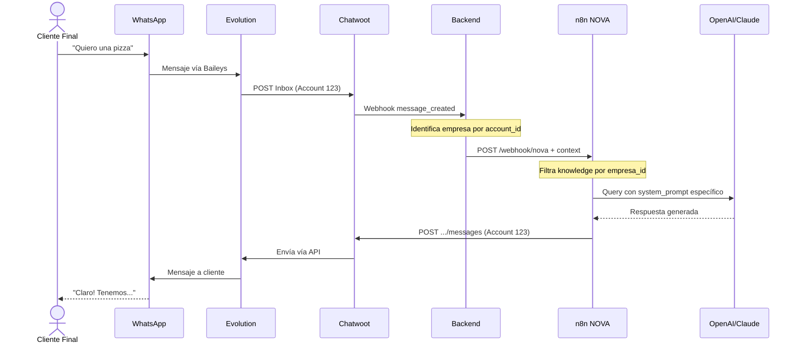

# 🏗️ Arquitectura Multi-Tenant: Chatwoot + Evolution API

> **Fecha**: 25 de Noviembre, 2025  
> **Versión**: 1.0  
> **Propósito**: Documentación técnica completa de la arquitectura multi-tenant para Flowify CRM

---

## 📋 Tabla de Contenidos

1. [Problema Original](#problema-original)
2. [Contexto Técnico Actual](#contexto-técnico-actual)
3. [Propuesta de Arquitectura](#propuesta-de-arquitectura)
4. [Análisis Crítico](#análisis-crítico)
5. [Aclaraciones Importantes](#aclaraciones-importantes)
6. [Arquitectura Final Aprobada](#arquitectura-final-aprobada)
7. [Plan de Implementación](#plan-de-implementación)
8. [Recursos y Escalabilidad](#recursos-y-escalabilidad)

---

## 🎯 Problema Original

### Contexto del Negocio

Flowify CRM es un sistema **multi-tenant** donde:
- Cada **empresa** (ej: Pizzería Lalo, Clínica Salud) es un cliente del CRM
- Cada empresa tiene sus **propios contactos/clientes finales**
- Cada empresa debe poder conectar **WhatsApp, Instagram, Facebook** sin mezclar datos

### Problema Técnico

**¿Cómo manejar múltiples cuentas de Chatwoot sin que los datos se crucen entre empresas?**

Si todas las empresas comparten una sola cuenta de Chatwoot:
- ❌ Los agentes de Pizzería Lalo verían conversaciones de Clínica Salud
- ❌ Los contactos se mezclarían
- ❌ No se pueden aislar permisos por empresa
- ❌ Los reportes serían compartidos

---

## 🔧 Contexto Técnico Actual

### Infraestructura Existente

```
VPS Easypanel (8GB RAM)
├── Chatwoot (Self-Hosted)
│   └── Super Admin Console: ✅ Disponible
├── Evolution API (Self-Hosted)
│   └── Versión: 2.2.3
├── PostgreSQL (Supabase)
├── Redis
└── n8n (Workflows)
```

### Backend Actual (FastAPI)

**Modelo Empresa**:
```python
# app/models/empresa.py
class Empresa(Base):
    id = Column(Integer, primary_key=True)
    nombre = Column(String(200))
    slug = Column(String(100), unique=True)
    
    # IDs de servicios externos
    chatwoot_account_id = Column(String(100), nullable=True)  # ✅ Ya existe
    evolution_instance_id = Column(String(100), nullable=True)  # ✅ Ya existe
    
    # ⚠️ FALTAN (propuesta de implementación):
    # chatwoot_api_key = Column(String, nullable=True)
    # chatwoot_webhook_id = Column(Integer, nullable=True)
```

**ChatwootClient Actual**:
```python
# app/integrations/chatwoot_client.py
class ChatwootClient:
    def __init__(self):
        # ⚠️ SINGLETON - Usa variables globales
        self.api_token = settings.CHATWOOT_API_KEY
        self.account_id = settings.CHATWOOT_ACCOUNT_ID
```

---

## 🏗️ Propuesta de Arquitectura

### Modelo de Chatwoot (Platform API)

```
1 Instalación Chatwoot Self-Hosted
├── Account 1: Pizzería Lalo (account_id: 1)
│   ├── Inbox: WhatsApp Pizzería
│   ├── Inbox: Instagram Pizzería
│   └── Contacts: Clientes de pizzería
│
├── Account 2: Clínica Salud (account_id: 2)
│   ├── Inbox: WhatsApp Clínica
│   └── Contacts: Pacientes de clínica
│
└── Account N: ...
```

### Modelo de Evolution API (Instancias)

**IMPORTANTE**: Una "instancia" NO es un contenedor Docker separado.

```
1 Evolution API (single container)
├── Instance 1: lentesdecontacto (Connected) → 50-100MB
├── Instance 2: zambrano (Connected) → 50-100MB
├── Instance 3: pizzeria-lalo (Connected) → 50-100MB
└── Instance N: ... → 50-100MB cada una
```

Cada instancia = 1 sesión de WhatsApp (como tabs de WhatsApp Web)

---

## 🔍 Análisis Crítico

### ✅ Ventajas de la Arquitectura Propuesta

1. **Aislamiento Total**: Cada empresa tiene Account separado en Chatwoot
2. **Escalabilidad**: Platform API permite crear Accounts programáticamente
3. **Un Solo Workflow n8n**: Maneja todas las empresas dinámicamente
4. **Control Total**: Self-hosted = control completo de datos
5. **Eficiencia de Recursos**: No duplica contenedores, solo sesiones

### ⚠️ Consideraciones Importantes

#### 1. **Platform API: Requisito Crítico**

Para automatizar creación de Accounts:
```bash
# Acceso requerido
https://chatwoot-url.com/super_admin

# Crear Platform App (una vez)
# Obtener: platform_token
```

Sin Platform API → implementación manual por empresa.

#### 2. **Ciclo de Vida de Instancias Evolution**

Estados de conexión:
```
connecting → qrcode → connected → close
```

Necesitas manejar:
- Reconexiones cuando WhatsApp se desconecta
- QR codes expirados (1 minuto)
- Notificaciones al usuario

#### 3. **Transacciones Distribuidas**

Flujo de onboarding tiene 6 pasos en 3 sistemas:
```
1. Crear Account Chatwoot → 2s
2. Crear Usuario Admin → 1s
3. Crear Webhook → 1s
4. Crear Instancia Evolution → 2s
5. Configurar Webhook Evolution → 1s
6. Integrar Evolution-Chatwoot → 2s

Total: ~10 segundos
```

**Si falla paso 4**: Ya creaste Account + Usuario + Webhook (rollback complejo)

#### 4. **n8n Workflow Universal**

```javascript
// Payload dinámico desde backend
{
  "empresa_id": 1,
  "empresa_slug": "pizzeria-lalo",
  "chatwoot_api_key": "abc123",  // 🔑 Token específico
  "chatwoot_account_id": 123,
  "system_prompt": "Eres asistente de pizzería...",
  "chatwoot_payload": { /* webhook original */ }
}
```

n8n filtra por `empresa_id` en:
- Vector store (knowledge base)
- System prompt
- Envío a Chatwoot Account específico

---

## 💡 Aclaraciones Importantes

### Concepto de "Instancia" en Evolution API

**Confusión inicial**: Se interpretó como contenedores Docker separados.

**Realidad**:
```python
# 1 Evolution API (1 container)
# Múltiples instancias (sesiones WhatsApp)

POST /instance/create
{
  "instanceName": "pizzeria-lalo"
}

# Retorna QR code
# Usuario escanea → estado: "connected"
# Consumo: ~50-100MB adicional
```

**No es**: 1 contenedor por empresa  
**Es**: 1 sesión de WhatsApp por empresa en el mismo contenedor

### Consumo de Recursos Real

Con **VPS 8GB RAM**:

| Servicio | RAM Base | RAM por Instancia/Cliente | Total (5 clientes) |
|----------|----------|---------------------------|-------------------|
| Evolution API | 500MB | 50-100MB | ~700MB - 1GB |
| Chatwoot | 1.5-2GB | - | ~2GB |
| PostgreSQL | 500MB | - | ~500MB |
| Redis | 100MB | - | ~100MB |
| n8n | 300MB | - | ~300MB |
| Sistema Operativo | 1GB | - | ~1GB |
| **Total Usado** | | | **~5GB** |
| **Margen Restante** | | | **~3GB** ✅ |

**Capacidad estimada**: 20-30 instancias Evolution cómodamente.

---

## 🎯 Arquitectura Final Aprobada

### Stack Completo

```
┌─────────────────────────────────────────────────────────┐
│               Frontend (Next.js)                        │
│         Usuario: Click "Conectar WhatsApp"              │
└─────────────────────────────────────────────────────────┘
                        ▼
┌─────────────────────────────────────────────────────────┐
│            Backend FastAPI (Tu CRM)                     │
│  POST /api/whatsapp/connect                             │
│  ├─ Crear Account en Chatwoot                           │
│  ├─ Crear Usuario Admin en Chatwoot                     │
│  ├─ Configurar Webhook Chatwoot                         │
│  ├─ Crear Instancia en Evolution                        │
│  ├─ Configurar Webhook Evolution                        │
│  ├─ Integrar Evolution → Chatwoot                       │
│  └─ Retornar QR Code                                    │
└─────────────────────────────────────────────────────────┘
       ▼                    ▼                    ▼
┌──────────────┐  ┌──────────────────┐  ┌──────────────┐
│  Evolution   │  │  Chatwoot        │  │  n8n         │
│  API         │◄─┤  Multi-Account   │◄─┤  (NOVA)      │
│              │  │                  │  │              │
│ Instance 1   │  │  Account 1       │  │  1 Workflow  │
│ Instance 2   │  │  Account 2       │  │  para todos  │
│ Instance N   │  │  Account N       │  │              │
└──────────────┘  └──────────────────┘  └──────────────┘
```

### Flujo de Onboarding Automático

```mermaid
sequenceDiagram
    actor U as Usuario (Pizzería Lalo)
    participant FE as Frontend
    participant BE as Backend API
    participant CW as Chatwoot
    participant EVO as Evolution API

    U->>FE: Click "Conectar WhatsApp"
    FE->>BE: POST /api/whatsapp/connect
    
    Note over BE,CW: Paso 1-2: Setup Chatwoot Account
    BE->>CW: POST /platform/api/v1/accounts
    CW-->>BE: {account_id: 123, api_key: "abc"}
    BE->>CW: POST /platform/.../account_users
    CW-->>BE: {user_id: 456}
    
    Note over BE,EVO: Paso 3-4: Setup Evolution Instance
    BE->>EVO: POST /instance/create
    EVO-->>BE: {qrcode: "base64..."}
    BE->>EVO: POST /webhook/set/:instance
    EVO-->>BE: 200 OK
    
    Note over BE,EVO,CW: Paso 5: Integración Auto-Mágica ✨
    BE->>EVO: POST /chatwoot/set/:instance<br/>{auto_create: true, import_contacts: true}
    EVO->>CW: AUTO-CREA Inbox en Account 123
    CW-->>EVO: {inbox_id: 999}
    EVO->>EVO: Prepara importación de contactos/msgs
    EVO-->>BE: 200 OK
    
    BE-->>FE: {qrcode: "base64...", status: "waiting"}
    FE-->>U: 📱 Muestra QR Code
    
    U->>EVO: Escanea con WhatsApp
    EVO-->>BE: Webhook: connection.update (open)
    EVO->>CW: Importa contactos + mensajes (7 días)
    BE-->>FE: WebSocket: "connected"
    FE-->>U: ✅ ¡WhatsApp Conectado!
```

### Flujo de Mensajes en Tiempo Real



---

## 📋 Plan de Implementación

### Fase 0: Preparación (1-2 horas)

- [ ] Agregar campos a modelo `Empresa`:
  ```python
  chatwoot_api_key = Column(String, nullable=True)
  chatwoot_webhook_id = Column(Integer, nullable=True)
  ```
- [ ] Crear migración Alembic
- [ ] Agregar variables de entorno:
  ```bash
  CHATWOOT_PLATFORM_TOKEN=xxx
  EVOLUTION_API_URL=xxx
  EVOLUTION_API_KEY=xxx
  BACKEND_URL=https://api.flowify.com
  ```

### Fase 1: Platform API Client (2-3 horas)

**Archivo**: `backend/app/integrations/chatwoot_platform.py`

```python
class ChatwootPlatformClient:
    async def create_account(name, email)
    async def create_account_user(account_id, email, name)
    async def create_webhook(account_id, api_key, url)
```

**Test**: Crear Account manualmente y verificar en Chatwoot Admin

### Fase 2: Evolution API Client (2-3 horas)

**Archivo**: `backend/app/integrations/evolution_client.py`

```python
class EvolutionAPIClient:
    async def create_instance(instance_name: str, token: str = None)
    async def get_qr_code(instance_name: str)
    async def set_webhook(instance_name: str, webhook_url: str, events: list)
    async def set_chatwoot_integration(
        instance_name: str,
        chatwoot_url: str,
        account_id: int,
        token: str,
        name_inbox: str,
        import_contacts: bool = True,         # ✅ Importar contactos WhatsApp
        import_messages: bool = True,         # ✅ Importar mensajes
        days_limit_import_messages: int = 7,  # ✅ Últimos N días
        auto_create: bool = True              # ✅ Auto-crear Inbox
    )
    async def get_connection_state(instance_name: str)
    async def delete_instance(instance_name: str)
```

**Test**: Crear instancia y verificar en Evolution Manager

### Fase 3: Modificar `/admin/empresas` (1-2 horas)

**Actualizar**: `backend/app/api/admin.py`

```python
@router.post("/admin/empresas")
async def crear_empresa(...):
    # ... código existente ...
    
    # NUEVO: Crear Account en Chatwoot
    chatwoot_account = await platform_client.create_account(...)
    empresa.chatwoot_account_id = chatwoot_account["id"]
    empresa.chatwoot_api_key = chatwoot_account["access_token"]
    
    # ... guardar en BD ...
```

**Test**: Crear empresa y verificar Account en Chatwoot

### Fase 4: Endpoint de Onboarding WhatsApp (3-4 horas)

**Crear**: `backend/app/api/whatsapp.py`

```python
@router.post("/api/whatsapp/connect")
async def conectar_whatsapp():
    """
    Flujo SIMPLIFICADO de onboarding:
   
    PRE-REQUISITO: Empresa ya tiene chatwoot_account_id y chatwoot_api_key
    (creados en /admin/empresas - Fase 3)
    
    1. Validar que empresa tiene Account de Chatwoot
    2. Crear instancia en Evolution API
    3. Configurar webhook en Evolution
    4. Configurar integración Chatwoot en Evolution (auto_create=True)
       └─► Evolution AUTOMÁTICAMENTE:
           ├─ Crea Inbox en Chatwoot
           ├─ Importa contactos de WhatsApp
           └─ Importa mensajes (últimos 7 días)
    5. Retornar QR code
    6. Esperar webhook connection.update para confirmar
    """
```

**Test**: Conectar WhatsApp real y verificar:
- Inbox creado en Chafatwoot
- Contactos importados
- Mensajes históricos importados

### Fase 5: Webhook Handlers (2 horas)

**Actualizar**: `backend/app/api/webhooks_chatwoot.py`

```python
@router.post("/webhooks/chatwoot")
async def webhook_chatwoot(request):
    payload = await request.json()
    account_id = payload["account"]["id"]
    
    # Buscar empresa por chatwoot_account_id (no global)
    empresa = await db.execute(
        select(Empresa).where(Empresa.chatwoot_account_id == account_id)
    )
```

**Crear**: `backend/app/api/webhooks_evolution.py`

```python
@router.post("/webhooks/evolution")
async def webhook_evolution(request):
    """
    Eventos:
    - qrcode.updated → Enviar nuevo QR al frontend
    - connection.update → Notificar conexión/desconexión
    """
```

### Fase 6: Health Checks y Monitoreo (2-3 horas)

**Crear**: `backend/app/tasks/whatsapp_monitor.py`

```python
@scheduler.scheduled_job('interval', hours=1)
async def check_whatsapp_connections():
    """
    Cada hora:
    1. Verificar estado de instancias
    2. Notificar desconexiones
    3. Limpiar instancias antiguas
    """
```

### Fase 7: Frontend (4-6 horas)

**Crear**: `frontend/components/WhatsAppConnect.tsx`

Componente con:
- Botón "Conectar WhatsApp"
- Spinner de loading (ConfigurandO...)
- QR Code display
- Polling de estado
- Notificación de éxito

---

## 📊 Recursos y Escalabilidad

### Configuración Actual

| Recurso | Capacidad Actual | Uso Actual | Uso con 5 Clientes | Margen |
|---------|------------------|------------|-------------------|--------|
| RAM | 8GB | ~2GB | ~5GB | 3GB ✅ |
| CPU | 2-4 vCPU | ~20% | ~40% | 60% ✅ |
| Disco | Variable | - | +2GB | ✅ |

### Plan de Escalamiento

| Clientes | RAM Necesaria | VPS Recomendado | Costo Estimado |
|----------|---------------|-----------------|----------------|
| 1-5 | ~5GB | 8GB (actual) | $0 |
| 6-15 | ~8GB | 8GB (actual) | $0 |
| 16-30 | ~12GB | 16GB | +$40/mes |
| 31-50 | ~20GB | 32GB o 2x16GB | +$80-120/mes |

**Regla de oro**: Upgrade cuando llegues al 80% de RAM utilizada.

### Límites Técnicos

**Evolution API**:
- Límite teórico: ~100 instancias por container
- Límite práctico (8GB): 20-30 instancias
- Límite recomendado inicial: 20 instancias

**Chatwoot**:
- Sin límite de Accounts (Platform API)
- Limitado solo por recursos del servidor

**n8n**:
- 1 workflow para todas las empresas
- Sin límite de ejecuciones

---

## 🚨 Consideraciones de Producción

### 1. Manejo de Errores

**Rollback en caso de fallo**:
```python
try:
    # Paso 1-6 del onboarding
    pass
except Exception as e:
    # Cleanup
    if chatwoot_account_created:
        # TODO: Platform API no tiene DELETE (marcar como "pending_cleanup")
        pass
    if evolution_instance_created:
        await evolution_client.delete_instance(instance_name)
    raise HTTPException(500, detail=str(e))
```

### 2. Rate Limiting

```python
# Límite: 10 empresas creadas por hora
@router.post("/api/whatsapp/connect")
@limiter.limit("10/hour")
async def conectar_whatsapp():
    ...
```

### 3. Monitoring y Alertas

```python
# Monitoreo crítico
- Instancias desconectadas > 24h → Email al usuario
- RAM usage > 80% → Alerta a admin
- Evolution API down → Alerta crítica
- Chatwoot down → Alerta crítica
```

### 4. Backup

```bash
# Sesiones de Evolution
/evolution/instances/ → Backup semanal a S3/Supabase

# Database
PostgreSQL dump diario (Supabase automático)
```

### 5. Testing

```python
# Tests críticos
- test_create_chatwoot_account()
- test_create_evolution_instance()
- test_full_onboarding_flow()
- test_webhook_multi_tenant()
- test_instance_reconnection()
```

---

## 📚 Referencias

### Documentación Oficial

- **Chatwoot Platform API**: https://www.chatwoot.com/developers/api/platform
- **Evolution API**: https://github.com/EvolutionAPI/evolution-api
- **Evolution Manager**: https://github.com/EvolutionAPI/evolution-manager

### Archivos Clave del Proyecto

- Modelo Empresa: `backend/app/models/empresa.py`
- Chatwoot Client actual: `backend/app/integrations/chatwoot_client.py`
- Admin endpoints: `backend/app/api/admin.py`
- Webhook Chatwoot: `backend/app/api/webhooks_chatwoot.py`

### Conversaciones de Referencia

- Conversación con Claude IA: `docs/LOGICA DE CHATWOOT.md`
- Análisis crítico: Este documento

---

## ✅ Checklist de Implementación

### Pre-requisitos
- [x] Chatwoot self-hosted funcionando
- [x] Evolution API self-hosted funcionando
- [x] Acceso a Super Admin Console de Chatwoot
- [ ] Platform App creado en Chatwoot
- [ ] `CHATWOOT_PLATFORM_TOKEN` obtenido

### Backend
- [ ] Migración BD: agregar `chatwoot_api_key`, `chatwoot_webhook_id`
- [ ] `ChatwootPlatformClient` creado
- [ ] `EvolutionAPIClient` creado
- [ ] `/admin/empresas` modificado
- [ ] `/api/whatsapp/connect` creado
- [ ] Webhooks multi-tenant actualizados
- [ ] Health checks implementados
- [ ] Tests escritos y pasando

### Frontend
- [ ] Componente `WhatsAppConnect` creado
- [ ] Integración WebSocket para estado real-time
- [ ] UI de QR code
- [ ] Manejo de errores y loading states

### Despliegue
- [ ] Variables de entorno configuradas
- [ ] Migración ejecutada en producción
- [ ] Backup configurado
- [ ] Monitoreo activo
- [ ] Alertas configuradas

### Testing Real
- [ ] Crear empresa de prueba
- [ ] Conectar WhatsApp de prueba
- [ ] Verificar mensajes bidireccionales
- [ ] Crear segunda empresa
- [ ] Verificar aislamiento de datos
- [ ] Probar desconexión y reconexión

---

**Última actualización**: 2025-11-25  
**Próxima revisión**: Después de Fase 1 completada
